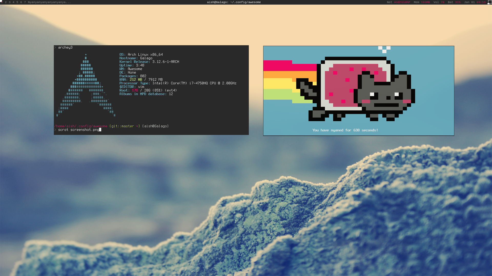

AwesomeWM configuration
=======================
My current awesomewm setup

Requirments
-----------
- [lain](https://github.com/copycat-killer/lain) (for mpd widget)
- [couth](https://github.com/gorlowski/couth) (for volume indicator)
- [vicious](http://awesome.naquadah.org/wiki/Vicious) (for wifi widget, mem widget, etc..)
- (Optional) the zsh theme matches this setup and can be found [here](https://github.com/aishsingh/zsh/tree/master/frisk-red) 

Screenshot
----------

